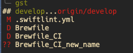
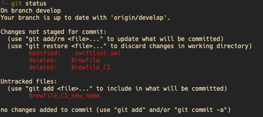

# Git Tips

This file covers different, advanced use cases of git with practical shell examples.

## Git

### Finding source of conflicts

💡 **Did you ever wondered where a PR conflict comes from?**

With a lot of stuff merged on the default branch, e.g. `develop`, between opening the PR and finally merging it quite some time can pass.

On the command line you can run the following for the conflicting file, which will give you
* **author**
* **commit message**
* **commit date** and
* some more meta infos about the conflicting file since the specified date

Regarding the date, it would be clever to enter the PR opening date 🤷

```shell
git log --since="2026-02-03" --stat -- <path/to/file>
```

Now you can simply check the content of the logged commits on GitHub which makes it WAY easier to solve the conflict. If you like the console VERY much, you can also view the changes directly there by replacing `--stat` by `-p` 👍

### Git Superpowers with forgit

💡 **Did you ever wish git commands were more interactive and faster to use?**

[forgit](https://github.com/wfxr/forgit) gives git superpowers by creating tons of aliases for git on top of the fuzzy finder FZF. It makes browsing logs, staging files, and viewing diffs a breeze — all interactively in the terminal.

```shell
glo     # interactive git log
ga      # interactive git add (stage files)
gd      # interactive git diff
gco     # interactive git checkout
gcf     # interactive git checkout file
gcb     # interactive git checkout branch
gbd     # interactive git branch delete
grh     # interactive git reset HEAD
gi      # interactive .gitignore generator
gfu     # interactive git fixup
gclean  # interactive git clean
gss     # interactive git stash show
gcp     # interactive git cherry-pick
```

### Smart Fixup Commits with git absorb

💡 **Do you struggle to figure out which commit a staged change belongs to when working on a PR?**

When your staged changes need to be fixed up across multiple commits, `git absorb` does the heavy lifting for you. It checks *for each hunk* of your *staged changes* which existing commit is the right candidate for a fixup and automatically creates the fixup commit.

```shell
git absorb
```

*Further info:* [Super-charging git rebase with git absorb](https://andrewlock.net/super-charging-git-rebase-with-git-absorb/)

### Rebase with Local Changes via autoStash

💡 **Do you still do `stash` → `rebase` → `pop` when rebasing with local changes?**

There is an easier solution by just enabling `autoStash` in your global `~/.gitconfig` file. Git will then automatically stash your local changes before the rebase and restore them afterwards.

```gitconfig
[rebase]
    autoStash = true
```

### Branch Descriptions

💡 **Did you know that you can add a description text to a branch?**

With many branches and experiments laying around that comes in very helpful. Sadly the description is not synced with remote, but at least it is possible locally. Set it with:

```shell
git branch --edit-description
```

And retrieve it using:

```shell
git config branch.$(git branch --show-current).description
```

### Supercharged git status

💡 **Do you want to take your terminal's `git status` display to the next level?**

Create an alias in your `~/.zshrc` like so:

```shell
alias gst="git status -sb"
```

The difference is plain great simplicity 🤩

`git status -sb` | `git status`
--- | ---
 | 

